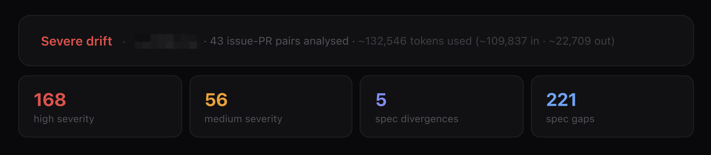
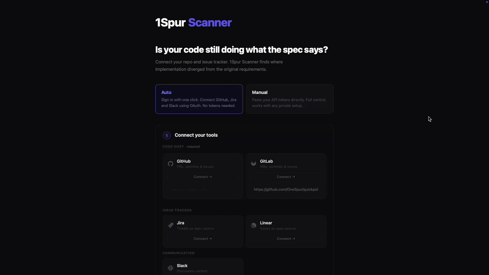

<div align="center">


# 1Spur Scanner

[](LICENSE)
[](https://python.org)
[](https://anthropic.com)
[](https://1spur.com)

</div>

An AI scanner that reviews code through the eyes of a PM and System Architect:
- It finds deviations of code from system design, tasks, docs.
- Offers to generate code / text for detected discrepancies.



## Why 1Spur Scanner?
The goal of 1Spur is to prevent tech debt from accumulating, reduce the number of code rewrites, and hit business expectations more accurately:
- finds bugs based on context from Jira/Linear/Slack that other scanners and code review helpers miss
- looks at code through the eyes of the business, reporting errors that are usually only noticed at demo or in production

1Spur Scanner is a proof-of-concept of a **[Sync Engine for everything your team ships](https://1spur.app)**.



## Quickstart

### Install with uv (recommended)

[uv](https://docs.astral.sh/uv/) handles Python, dependencies, and the CLI tool — nothing else to install.

```bash
# 1. Install uv (if you don't have it)
curl -LsSf https://astral.sh/uv/install.sh | sh

# 2. Install 1Spur Scanner
uv tool install git+https://github.com/OneSpur/scanner

# 3. Run
1spur-scanner
```

Open **http://localhost:7433**

To update to the latest version:

```bash
uv tool install --reinstall git+https://github.com/OneSpur/scanner
```

### Install with pip

```bash
pip install git+https://github.com/OneSpur/scanner
1spur-scanner
```

## How it's structured

```
drift-check/
  scanner/
    main.py            # Web server + job orchestration
    github.py          # GitHub data fetcher
    analyzer.py        # Drift scoring + AI analysis
    report.py          # HTML report generator
    templates/         # HTML templates
    static/            # Static assets
```

## AI model options

### Option A: Claude Code (recommended)

Uses your existing Claude Pro or Max subscription. No API key needed.

How it works: 1Spur Scanner shells out to `claude -p` (the headless print mode) which reads the OAuth credentials stored by Claude Code on your machine. The subprocess inherits the login automatically.

Requirements:

1. Install Claude Code: `npm install -g @anthropic-ai/claude-code` or via the Claude desktop app
2. Run `claude` and log in at least once (authenticates via browser, stores credentials)
3. Have an active Claude Pro or Max subscription

That is all. No configuration needed. Select **Claude Code** in the model selector and submit.

### Option B: Local (free, private)

No data leaves your machine.

```bash
# 1. Install Ollama: https://ollama.com/download

# 2. Pull a model
ollama pull qwen3.5:9b

# 3. Start Ollama
ollama serve
```

The local model will appear automatically in the model selector.

### Option C: Claude API (best quality)

Get your key at [console.anthropic.com](https://console.anthropic.com), select **Claude API** in the model selector and paste it in.

### Option D: OpenAI API

Get your key at [platform.openai.com/api-keys](https://platform.openai.com/api-keys), select **OpenAI API** in the model selector and paste it in.

## GitHub token

Without a token you get 60 API requests/hour. Enough for small repos, but large ones will hit the limit.

Create one at **[github.com/settings/tokens](https://github.com/settings/tokens/new?description=1spur-scanner)**:


| Repo type       | Required scope    |
| --------------- | ----------------- |
| Public          | `public_repo`     |
| Private         | `repo`            |
| GitHub Projects | add`read:project` |

## Token usage

1Spur Scanner batches 2 issue-PR pairs per LLM call. Typical token consumption per scan:


| Pairs analysed | LLM calls | Tokens (approx) |
| -------------- | --------- | --------------- |
| 5 pairs        | 4         | ~10,000         |
| 10 pairs       | 6         | ~17,000         |
| 20 pairs       | 11        | ~32,000         |
| 30 pairs       | 16        | ~48,000         |

Each batch call uses ~3,200 tokens (system + 2 issue/diff pairs + output). One summary call adds ~700 tokens.

For Claude Code (Pro/Max), a typical 10-pair scan costs well within the daily usage allowance.


## Contribution

If you'd like to contribute your own example or fix a bug please make sure to take a look at **[CONTRIBUTING.md](https://github.com/OneSpur/scanner/blob/main/CONTRIBUTING.md)**
